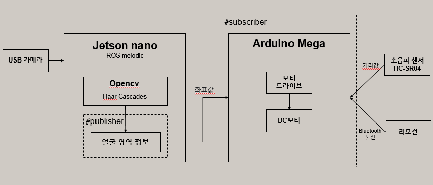
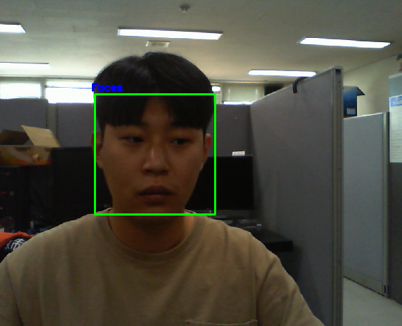
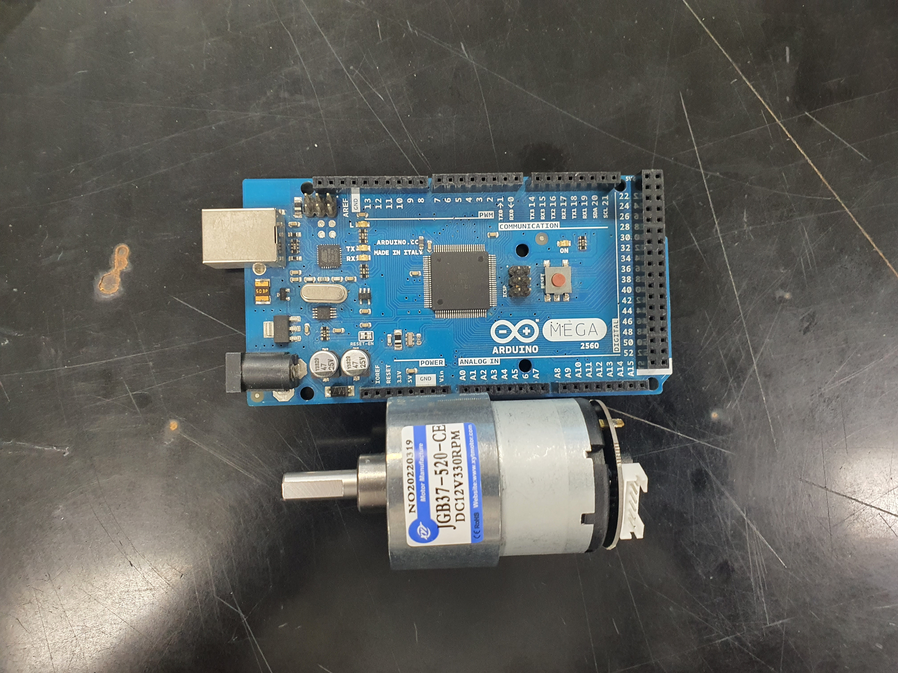

# Tracking Robot
***
## 1. 작품 배경  

오늘날 유튜브와 틱톡과 같은 미디어 시장이 계속해서 커져가고 있다.   
미디어 시장이 커지면서 자연스레 1인 방송인도 많아지고 있다.  
기존의 촬영 장비는 삼각대, 바디캠 정도가 있는데,   
1인 방송인들이 촬영을 진행할 때에는 큰 동작이 있거나 장소를 변경할 때 촬영 장비를 계속 재설치 해야 할 소요가 있다. 때문에 추가적인 인원 없이 영상 촬영을 대신해주는 장비를 생각하게 되었다.  

## 2. 작품 설명
본 작품은 촬영을 대신 해주는 얼굴 트래킹 촬영 로봇이다. 이름에도 들어가는 것처럼 사용자의 얼굴을 추적하여 얼굴이 중심에 오고 크기에 맞게 촬영을 해준다. 메카넘 휠을 사용하여 좌우 편히 이동을 할 수 있고, 사람이 촬영하는 것처럼 매끄럽게 촬영된다. 카메라 부분에는 짐벌을 이용하여 움직임간 흔들림을 보정하여 촬영이 가능하다.

## 3. 최종목표

촬영 대상을 카메라 중앙에 보이도록 추적을 함. 촬영 대상이 다수일 경우에도 특정 대상 한 명을 중심으로 추적하도록 함.  
촬영 대상과 일정 거리를 유지하며 촬영 대상 이동 시 장애물 회피하며 대상 추적하도록 함.  
카메라 영상을 통해 젯슨 나노 보드에서 영상 처리를 통해 촬영 대상을 인지하고, 그 결과값을 이용해 ROS 통신으로 라즈베리파이를 제어하도록 함.  

## 4. 블록도

</img>

## 5. 진행사항
* 영상처리   
  HaarCascade를 활용하여 얼굴 영역 검출 완료.   
     
  </img>
   
* ROS 통신   
젯슨 나노와 아두이노를 이용하여 ROS 시리얼 통신함. 현재 신호를 주고 받기를 완료함.   
   
  </img>
* 모터 제어   
6핀 DC모터를 아두이노에서의 사용방법 연구중   
  </img>

## 6. 남은 과정들

* 영상처리   
  Face Tracking 기술을 활용하여 얼굴 추적.
   
* ROS 통신   
  젯슨 나노와 아두이노 사이에서 원하는 데이터들을 주고 받을 수 있게 해야함.

* 제어   
  주고 받는 데이터들을 활용하여 모터나 센서등 제어기기를 알맞게 조절해야함.
  
## 7. 피드백
* 문제점   
  젯슨나노와 라즈베리파이로 ROS통신을 하면 서로 인터넷에 연결해야하는 상황이 발생됨.   
  

* 피드백 후 해결 방안   
  인터넷 필요없이 제어 가능한 아두이노로 ROS-Serial통신으로 대체함.   
    
